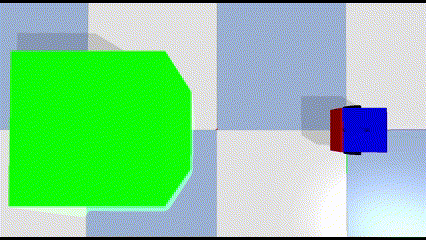
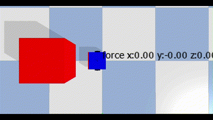
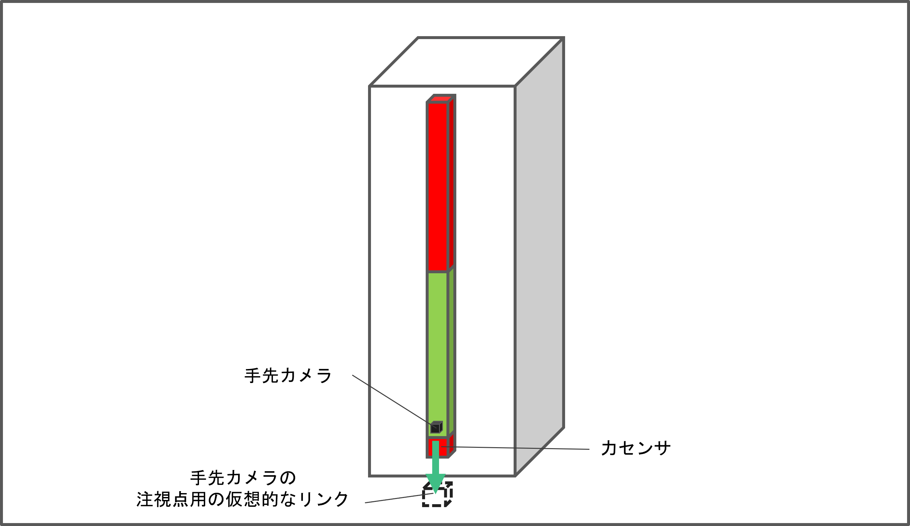

# PybulletRobotics

【[English version](https://github.com/akinami3/PybulletRobotics/blob/main/README_en.md)】

本リポジトリでは、ロボティクスにおけるpybulletの基本的な使用方法や、ロボティクスに関連する様々なアルゴリズムをpybulletを用いて実装する方法を紹介します。

# 目次
- [PybulletRobotics](#pybulletrobotics)
- [目次](#目次)
- [インストール方法](#インストール方法)
- [ロボティクスにおけるpybulletの基本的な使用方法](#ロボティクスにおけるpybulletの基本的な使用方法)
- [移動ロボット](#移動ロボット)
  - [基本](#基本)
    - [移動ロボットの基本的な制御](#移動ロボットの基本的な制御)
    - [移動ロボットにおけるセンサーの利用](#移動ロボットにおけるセンサーの利用)
  - [移動ロボットによるライントレース](#移動ロボットによるライントレース)
  - [そのた追加予定のコンテンツ](#そのた追加予定のコンテンツ)
- [ロボットアーム](#ロボットアーム)
  - [基本](#基本-1)
    - [ロボットアームの基本的な制御](#ロボットアームの基本的な制御)
    - [ロボットアームにおけるセンサーの利用](#ロボットアームにおけるセンサーの利用)
    - [衝突判定](#衝突判定)
  - [運動学](#運動学)
    - [三角関数による順運動学（後日追記予定）](#三角関数による順運動学後日追記予定)
    - [同次変換行列を用いた順運動学（後日追記予定）](#同次変換行列を用いた順運動学後日追記予定)
    - [解析的解法による逆運動学（後日追記予定）](#解析的解法による逆運動学後日追記予定)
    - [数値的解法によるヤコビ行列を用いた逆運動学（後日追記予定）](#数値的解法によるヤコビ行列を用いた逆運動学後日追記予定)
  - [その他、追加予定のコンテンツ](#その他追加予定のコンテンツ)


<!-- 本リポジトリで（現時点では）扱っていない主要そうなロボット
- ドローン
- ヒューマノイドロボット
- ソフトロボティクス
- ロボットハンド
- 四足歩行ロボット
- 蜘蛛型ロボット
- 蛇型ロボット -->

# インストール方法
pybulletでロボティクスのシミュレーションを実施する際に必要なライブラリをインストールする手順は以下になります。

環境：Ubuntu (WSLでも可)

```bash
sudo apt update
```

```bash
sudo apt install python3-pip
```

```bash
pip3 install pybullet
```

```bash
pip3 install numpy
```

```bash
pip3 install matplotlib
```

```bash
pip3 install opencv-contrib-python
```

```bash
pip install scipy
```


# ロボティクスにおけるpybulletの基本的な使用方法
以下に示すpybulletを用いたロボティクスの基本的な使用方法を紹介します。
- 環境の作成
- urdfファイルからのロボットの読み込み
- シミュレーションの実行

詳細は「[pybullet_basic.ipynb](https://github.com/akinami3/PybulletRobotics/blob/main/PybulletBasic/pybullet_basic.ipynb)」を参照。

# 移動ロボット

## 基本


### 移動ロボットの基本的な制御
2輪移動ロボットを移動させるシンプルなコードを紹介します。


詳細は「[mobile_robot_basic.ipynb](https://github.com/akinami3/PybulletRobotics/blob/main/MobileRobot/mobile_robot_basic.ipynb)」を参照。

### 移動ロボットにおけるセンサーの利用
2輪移動ロボットにおける以下のセンサーの利用方法を紹介します。
- 超音波センサー
- カメラ
- LiDAR
- 落下防止センサー
- バンパー

  

<br>

**超音波センサ**  


<br>

**カメラ**  


<br>

**Lidar**  


<br>

**落下防止センサー**  
  

<br>

**バンパー**   


詳細は「[mobile_robot_sensor.ipynb](https://github.com/akinami3/PybulletRobotics/blob/main/MobileRobot/mobile_robot_sensor.ipynb)」を参照。

## 移動ロボットによるライントレース
2輪の輪動ロボットのボトムカメラを使用してライントレースを行う方法を紹介します。


詳細は「[mobile_robot_line_trace.ipynb](https://github.com/akinami3/PybulletRobotics/blob/main/MobileRobot/mobile_robot_line_trace.ipynb)」を参照。

## そのた追加予定のコンテンツ
- 経路計画
- オドメトリ
- カルマンフィルタ
- パーティクルフィルタ
- SLAM
- 教師あり学習でライントレース
- 強化学習（Q学習）

# ロボットアーム

## 基本

### ロボットアームの基本的な制御
2軸ロボットアームを制御（位置制御、速度制御）するシンプルなコードを紹介します。

**位置制御**


<br>

**速度制御**


詳細は「[robot_arm_basic.ipynb](https://github.com/akinami3/PybulletRobotics/blob/main/RobotArm/robot_arm_basic.ipynb)」を参照。

### ロボットアームにおけるセンサーの利用
2軸ロボットアームにおける以下のセンサーの利用方法を紹介します。
- 手先のカメラ
- 手先の力センサー



<br>

**手先のカメラ**


<br>

**手先の力センサー**


詳細は「[robot_arm_sensor.ipynb](https://github.com/akinami3/PybulletRobotics/blob/main/RobotArm/robot_arm_sensor.ipynb)」を参照。

### 衝突判定
ロボットアームと物体の衝突判定を行う方法を紹介します。


詳細は「[robot_arm_collision_check.ipynb](https://github.com/akinami3/PybulletRobotics/blob/main/RobotArm/robot_arm_collision_check.ipynb)」を参照。

## 運動学

### 三角関数による順運動学（後日追記予定）
後日追記予定
<!-- 三角関数を用いたロボットアームの順運動学を紹介します。

詳細は「[robot_arm_trigonometric_forward_kinematics.ipynb](https://github.com/akinami3/PybulletRobotics/blob/main/RobotArm/robot_arm_trigonometric_forward_kinematics.ipynb)」を参照。 -->

### 同次変換行列を用いた順運動学（後日追記予定）
後日追記予定

<!-- 同次変換行列を用いたロボットアームの順運動学を紹介します。

詳細は「[robot_arm_homogeneous_matrix_forward_kinematics.ipynb](https://github.com/akinami3/PybulletRobotics/blob/main/RobotArm/robot_arm_homogeneous_matrix_forward_kinematics.ipynb)」を参照。 -->

### 解析的解法による逆運動学（後日追記予定）
後日追記予定

<!-- 解析的解法を用いたロボットアームの逆運動学を紹介します。

詳細は「[robot_arm_analytical_inverse_kinematics.ipynb](https://github.com/akinami3/PybulletRobotics/blob/main/RobotArm/robot_arm_analytical_inverse_kinematics.ipynb)」を参照。 -->

### 数値的解法によるヤコビ行列を用いた逆運動学（後日追記予定）
後日追記予定

<!-- 数値的解法を用いたロボットアームの逆運動学を紹介します。

詳細は「[robot_arm_jacobian_inverse_kinematics.ipynb](https://github.com/akinami3/PybulletRobotics/blob/main/RobotArm/robot_arm_jacobian_inverse_kinematics.ipynb)」を参照。 -->

## その他、追加予定のコンテンツ
- PID制御
- タスク空間における動作計画
- コンフィギュレーション空間を用いた動作計画
- 力制御
- 位置と力のハイブリッド制御
- インピーダンス制御
- ビジュアルサーボ

