# PybulletRobotics

[日本語のREADMEはこちら](https://github.com/akinami3/PybulletRobotics/blob/main/README_jp.md)

This repository contains “code for learning robotics algorithms” that can be executed with pybullet.

(The English documentation and comments on code in this repository are translated by ChatGPT.)

<br>

**Features:**


- Code to help you understand the algorithms of robotics.
- A physics simulation that can be run in the Python environment only.
  - Can be run in the Python environment only, making it easy to build an environment and concentrate on learning the algorithm.

**Notes:**

Since the code is for understanding algorithms, it may not be suitable for practical use, such as “optimizing processing speed” or “excessive comments on the code”.


# table of contents
- [PybulletRobotics](#pybulletrobotics)
- [table of contents](#table-of-contents)
- [Installation](#installation)
- [General](#general)
  - [Basic Usage of Pybullet](#basic-usage-of-pybullet)
  - [Detection of AR Marker Position and Orientation](#detection-of-ar-marker-position-and-orientation)
- [Mobile Robot](#mobile-robot)
  - [Basics](#basics)
    - [Basic Control of a Mobile Robot](#basic-control-of-a-mobile-robot)
    - [Using Sensors in a Mobile Robot](#using-sensors-in-a-mobile-robot)
  - [Line Trace](#line-trace)
  - [Position Estimation using Wheel Odometry](#position-estimation-using-wheel-odometry)
  - [Position Estimation Using Particle Filter](#position-estimation-using-particle-filter)
  - [Other Planned Content](#other-planned-content)
- [Robot Arm](#robot-arm)
  - [Basics](#basics-1)
    - [Basic Control of a Robot Arm](#basic-control-of-a-robot-arm)
    - [Using Sensors in a Robot Arm](#using-sensors-in-a-robot-arm)
    - [Collision Detection](#collision-detection)
  - [Kinematics](#kinematics)
    - [Forward Kinematics using Trigonometric Functions](#forward-kinematics-using-trigonometric-functions)
    - [Forward Kinematics using Homogeneous Transformation Matrix](#forward-kinematics-using-homogeneous-transformation-matrix)
    - [Inverse Kinematics using Analytical Methods](#inverse-kinematics-using-analytical-methods)
    - [Inverse Kinematics using Jacobian Matrix with Numerical Methods](#inverse-kinematics-using-jacobian-matrix-with-numerical-methods)
  - [Object Position Estimation using Eye-to-Hand](#object-position-estimation-using-eye-to-hand)
  - [Object Position Estimation using Eye-in-Hand](#object-position-estimation-using-eye-in-hand)
  - [Image-Based Visual Servo(IBVS)](#image-based-visual-servoibvs)
  - [Other Planned Content](#other-planned-content-1)
- [reference](#reference)
  - [site](#site)
    - [Created by the Author (written in Japanese)](#created-by-the-author-written-in-japanese)


<!-- 本リポジトリで（現時点では）扱っていない主要そうなロボット
- ドローン
- ヒューマノイドロボット
- ソフトロボティクス
- ロボットハンド
- 四足歩行ロボット
- 蜘蛛型ロボット
- 蛇型ロボット -->

# Installation
The following steps outline how to install the necessary libraries for running robotics simulations with pybullet.

The versions of each library used during the verification process are noted as comments next to each command.

Verified environment: Ubuntu (WSL is also acceptable)

```bash
sudo apt update
```

```bash
sudo apt install python3-pip
```

```bash
pip3 install pybullet # version 3.2.6
```

```bash
pip3 install numpy # version 1.24.3
```

```bash
pip3 install matplotlib # version 3.5.1
```

```bash
pip3 install opencv-contrib-python # version 4.5.4
```

```bash
pip install scipy # version 1.11.3
```


# General
## Basic Usage of Pybullet
Here, we introduce the basic usage of pybullet in robotics.
- Creating an environment
- Loading a robot from a URDF file
- Running a simulation

For details, refer to "[pybullet_basic.ipynb](https://github.com/akinami3/PybulletRobotics/blob/main/PybulletBasic/pybullet_basic_en.ipynb)".

## Detection of AR Marker Position and Orientation
This section introduces how to detect the position and orientation of AR markers from images captured by a camera.


<br>

For details, refer to "[ar_marker_detect.ipynb](https://github.com/akinami3/PybulletRobotics/blob/main/PybulletBasic/ar_marker_detect_en.ipynb)".

# Mobile Robot

## Basics

### Basic Control of a Mobile Robot
We introduce simple code to move a two-wheeled mobile robot.

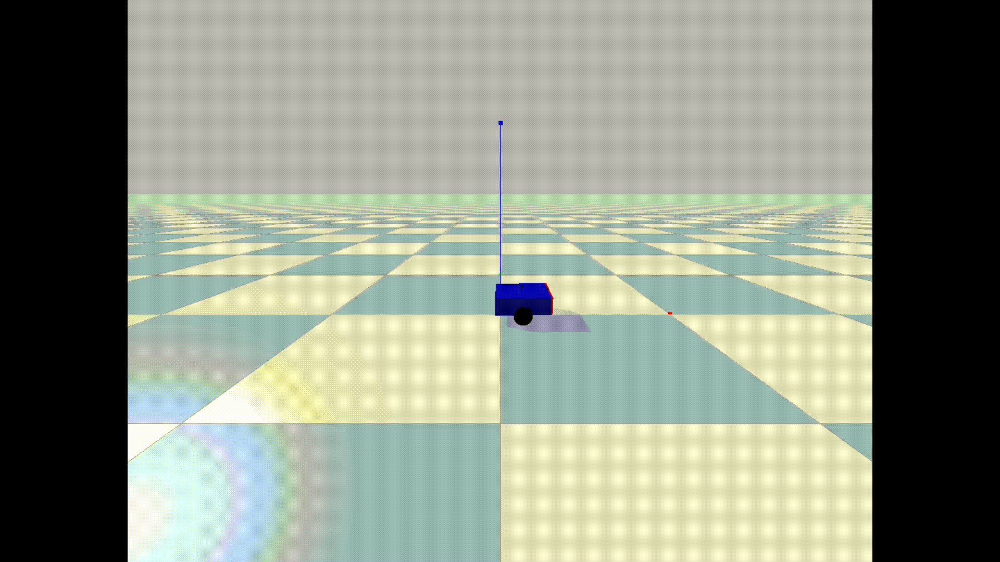


For details, refer to "[mobile_robot_basic.ipynb](https://github.com/akinami3/PybulletRobotics/blob/main/MobileRobot/mobile_robot_basic_en.ipynb)".

### Using Sensors in a Mobile Robot
We introduce how to use the following sensors in a two-wheeled mobile robot.
- Ultrasonic sensor
- Camera
- LiDAR
- Fall prevention sensor
- Bumper

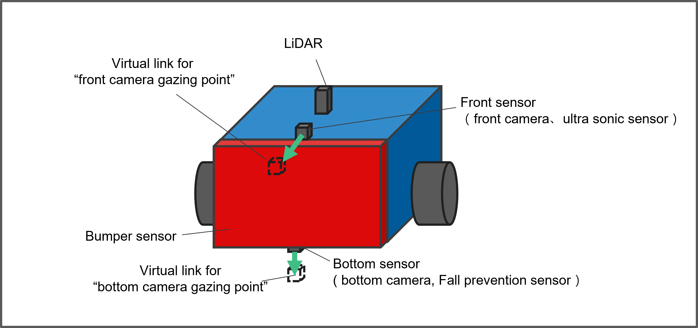  

<br>

**Ultrasonic sensor**  
  

<br>

**Camera**  
  

<br>

**LiDAR**  
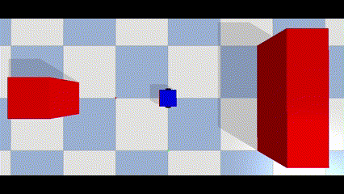  

<br>

**Fall prevention sensor**  
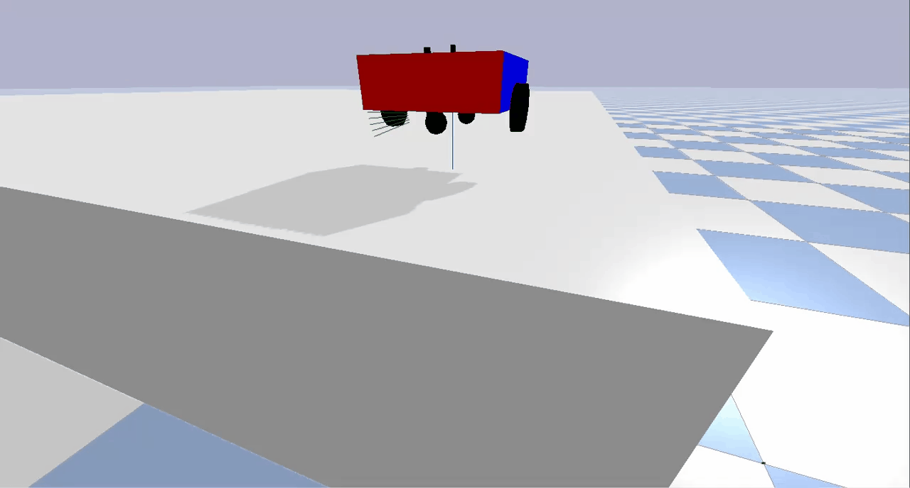  

<br>

**Bumper**   
 

For details, refer to "[mobile_robot_sensor.ipynb](https://github.com/akinami3/PybulletRobotics/blob/main/MobileRobot/mobile_robot_sensor_en.ipynb)".

## Line Trace
We introduce how to perform line tracing using the bottom camera of a two-wheeled mobile robot.

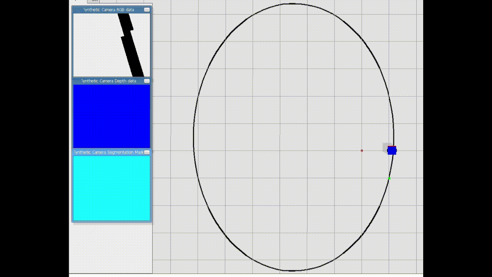

For details, refer to "[mobile_robot_line_trace.ipynb](https://github.com/akinami3/PybulletRobotics/blob/main/MobileRobot/mobile_robot_line_trace_en.ipynb)".

## Position Estimation using Wheel Odometry

We introduce how to perform position estimation using wheel odometry in a two-wheeled mobile robot.

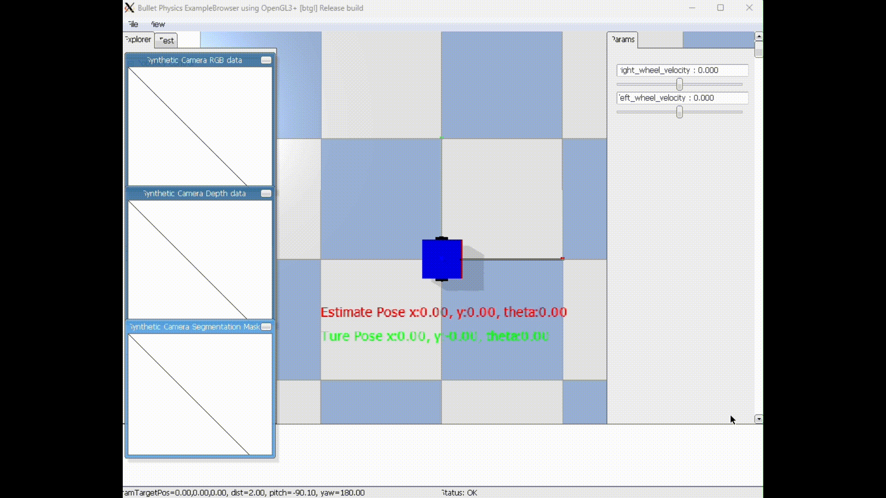

For details, refer to "[mobile_robot_wheel_odometry.ipynb](https://github.com/akinami3/PybulletRobotics/blob/main/MobileRobot/mobile_robot_wheel_odometry_en.ipynb)".


## Position Estimation Using Particle Filter

This section introduces how to perform position estimation using a particle filter for a two-wheeled mobile robot.

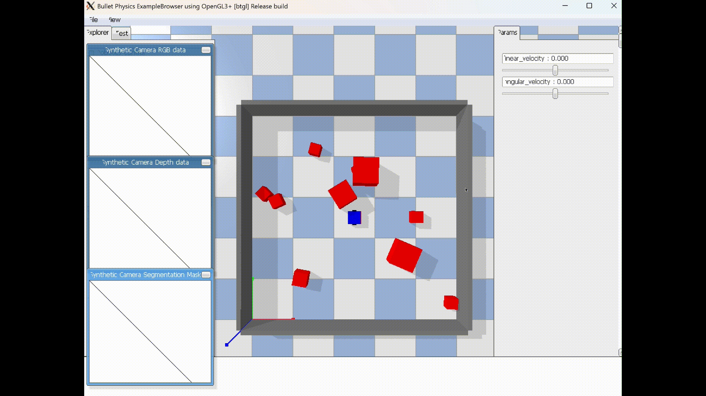

For more details, refer to "[mobile_robot_particle_filter.ipynb](https://github.com/akinami3/PybulletRobotics/blob/main/MobileRobot/mobile_robot_particle_filter_en.ipynb)".


## Other Planned Content
- Path Planning
- Kalman Filter
- SLAM
- Line Tracing with Supervised Learning
- Reinforcement Learning (Q-Learning)

# Robot Arm

## Basics

### Basic Control of a Robot Arm
We introduce simple code to control a two-axis robot arm (position control, velocity control, torque control).

**position control**

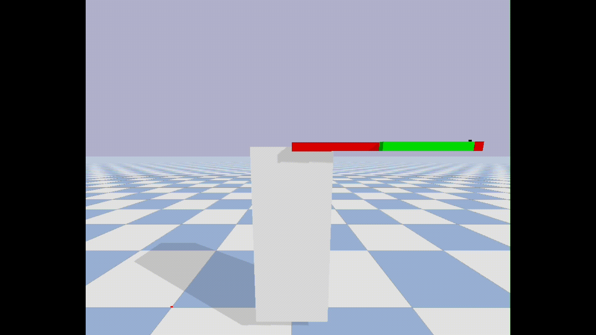

<br>

**velocity control**

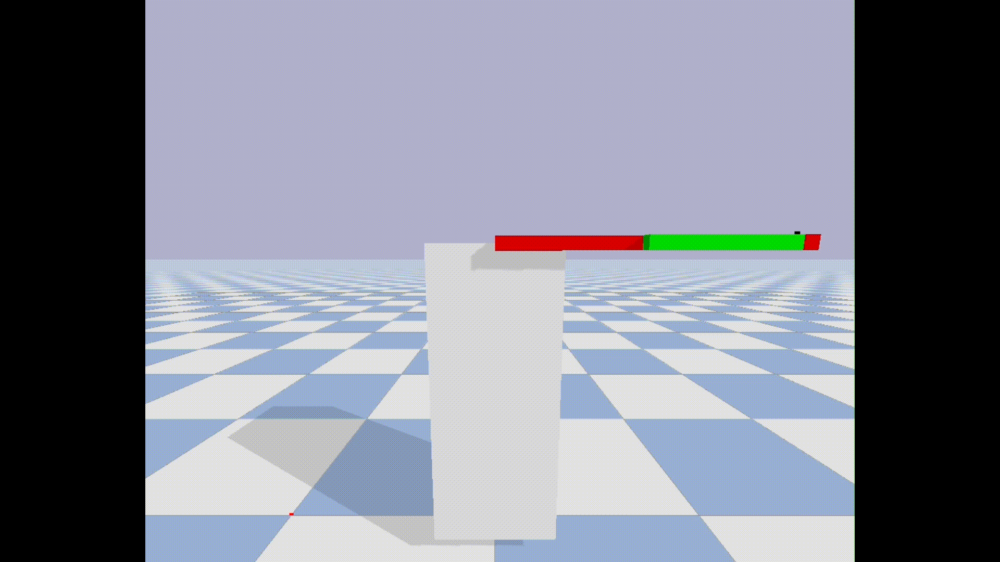


<br>

**torque control**

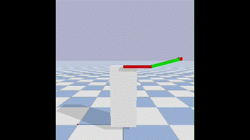


For details, refer to "[robot_arm_basic.ipynb](https://github.com/akinami3/PybulletRobotics/blob/main/RobotArm/robot_arm_basic_en.ipynb)".


### Using Sensors in a Robot Arm
We introduce how to use the following sensors in a two-axis robot arm.
- End-effector camera
- End-effector force sensor

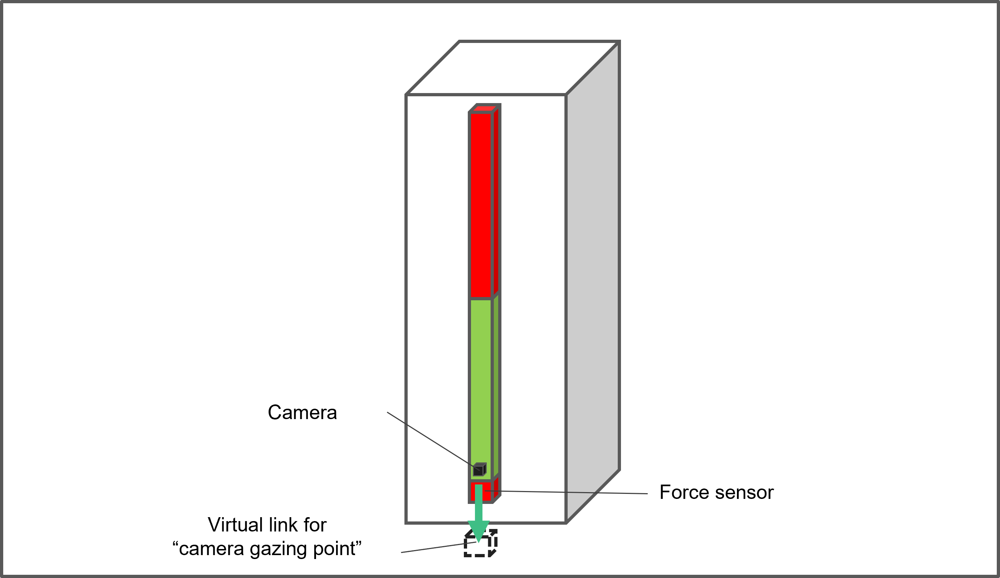

<br>

**End-effector camera**

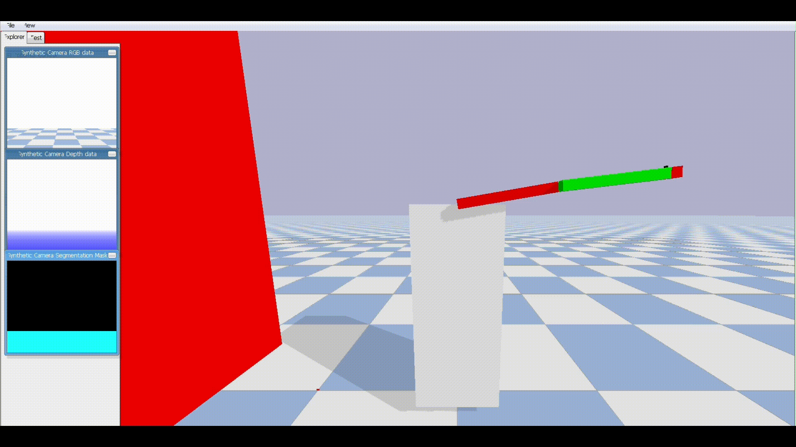

<br>

**End-effector force sensor**

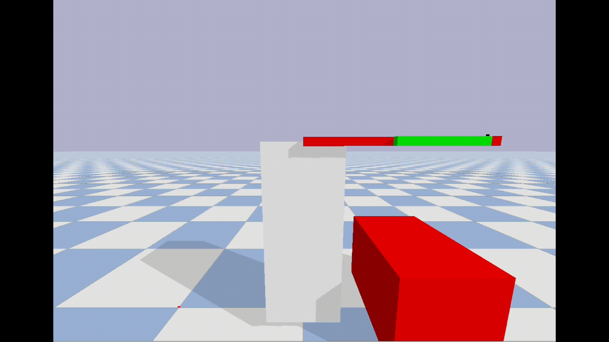


For details, refer to "[robot_arm_sensor.ipynb](https://github.com/akinami3/PybulletRobotics/blob/main/RobotArm/robot_arm_sensor_en.ipynb)".

### Collision Detection
We introduce how to perform collision detection between a robot arm and objects.


For details, refer to "[robot_arm_collision_check.ipynb](https://github.com/akinami3/PybulletRobotics/blob/main/RobotArm/robot_arm_collision_check_en.ipynb)".

## Kinematics

### Forward Kinematics using Trigonometric Functions
We introduce forward kinematics of a robot arm using trigonometric functions.

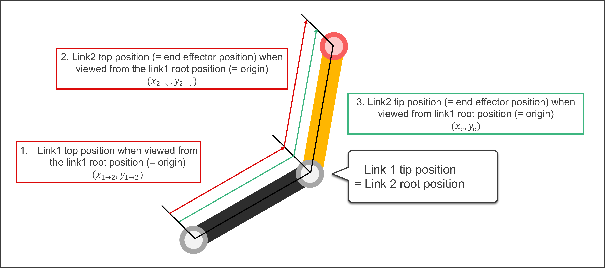

For details, refer to "[robot_arm_trigonometric_forward_kinematics.ipynb](https://github.com/akinami3/PybulletRobotics/blob/main/RobotArm/robot_arm_trigonometric_forward_kinematics_en.ipynb)".

### Forward Kinematics using Homogeneous Transformation Matrix
We introduce forward kinematics of a robot arm using homogeneous transformation matrix.

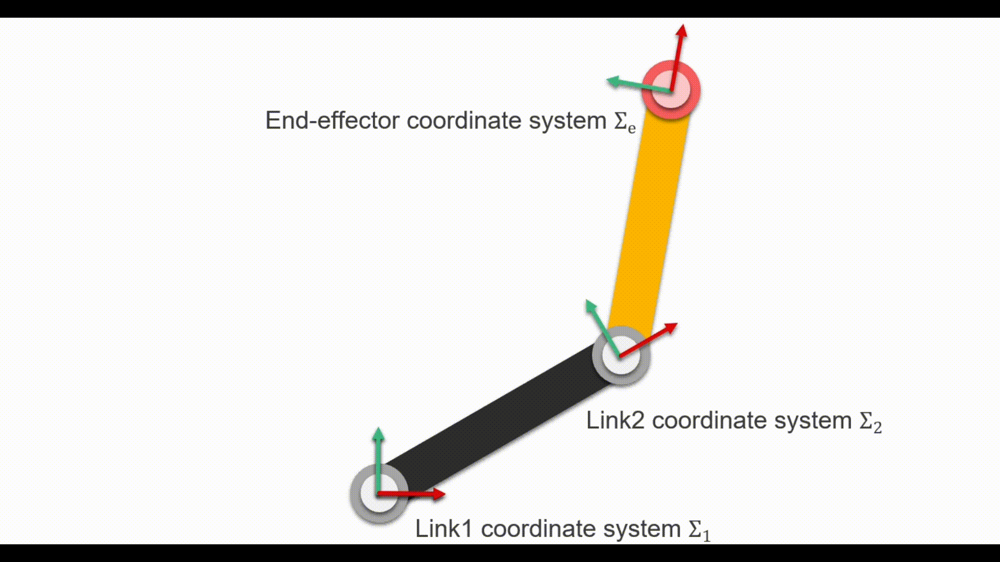

For details, refer to "[robot_arm_homogeneous_matrix_forward_kinematics.ipynb](https://github.com/akinami3/PybulletRobotics/blob/main/RobotArm/robot_arm_homogeneous_matrix_forward_kinematics_en.ipynb)".

### Inverse Kinematics using Analytical Methods

Introducing inverse kinematics for robot arms using analytical methods.


For more details, refer to "[robot_arm_analytical_inverse_kinematics.ipynb](https://github.com/akinami3/PybulletRobotics/blob/main/RobotArm/robot_arm_analytical_inverse_kinematics_en.ipynb)".

### Inverse Kinematics using Jacobian Matrix with Numerical Methods

Introducing inverse kinematics for robot arms using numerical methods.

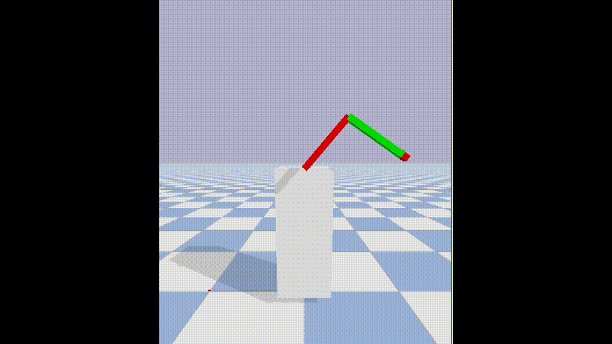

For more details, refer to "[robot_arm_jacobian_inverse_kinematics.ipynb](https://github.com/akinami3/PybulletRobotics/blob/main/RobotArm/robot_arm_jacobian_inverse_kinematics_en.ipynb)".

## Object Position Estimation using Eye-to-Hand
We introduce how to perform object position estimation using eye-to-hand.

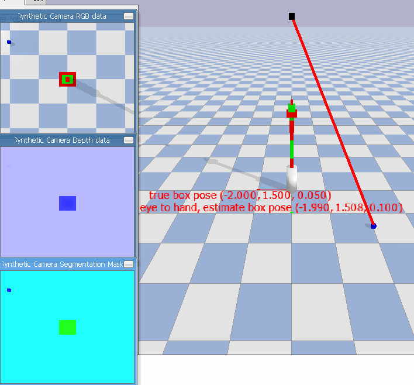

For details, refer to "[robot_arm_eye_to_hand.ipynb](https://github.com/akinami3/PybulletRobotics/blob/main/RobotArm/robot_arm_eye_to_hand_estimate_obj_pose_en.ipynb)".

## Object Position Estimation using Eye-in-Hand
We introduce how to perform object position estimation using eye-in-hand.

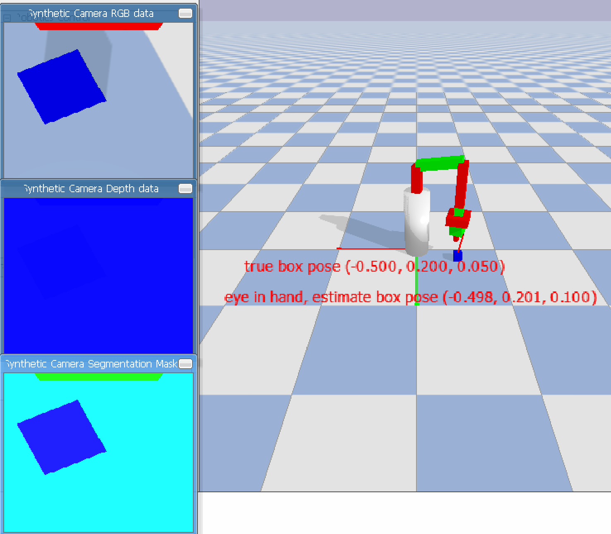

For details, refer to "[robot_arm_eye_in_hand.ipynb](https://github.com/akinami3/PybulletRobotics/blob/main/RobotArm/robot_arm_eye_in_hand_estimate_obj_pose_en.ipynb)".

## Image-Based Visual Servo(IBVS)
We introduce how to perform image-based visual servoing.


For details, refer to "[robot_arm_image_based_visual_servo.ipynb](https://github.com/akinami3/PybulletRobotics/blob/main/RobotArm/robot_arm_image_based_visual_servo_en.ipynb)".

## Other Planned Content
- PID Control
- Motion Planning in Task Space
- Motion Planning using Configuration Space
- Force Control
- Hybrid Position and Force Control
- Compliance Control

# reference

## site

- [pybullet_quickstart_guide](https://github.com/bulletphysics/bullet3/blob/master/docs/pybullet_quickstartguide.pdf)：This is a quick start guide summarizing the functions available in pybullet (official).
- [PythonRobotics](https://github.com/AtsushiSakai/PythonRobotics)：This repository compiles robotics algorithms implemented in Python. It includes various algorithms, making it an excellent resource for studying robotics.
- 
### Created by the Author (written in Japanese)
- [pybulletの公式サンプル129個を全部解説する - Qiita](https://qiita.com/akinami/items/7b433b60aeb5115ba4d7)：This article explains (or plans to explain) 129 official pybullet samples.
- [【図解】ロボティクスの辞書【python】](https://qiita.com/akinami/items/eb0741b0d9c322e5d5ec)：This is a summary article of articles explaining technologies related to robotics.
