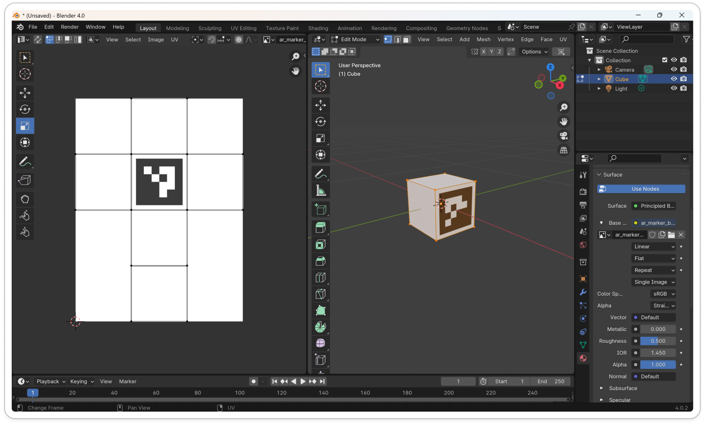
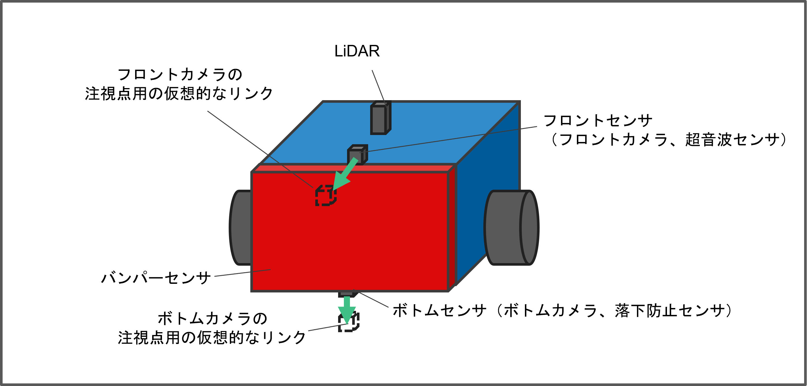
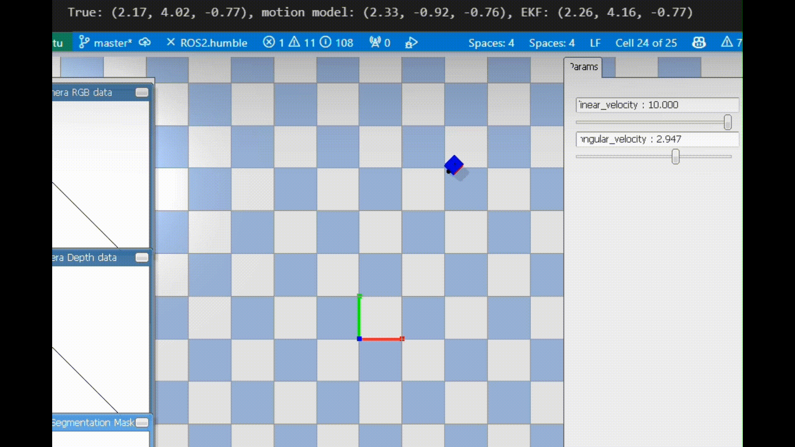
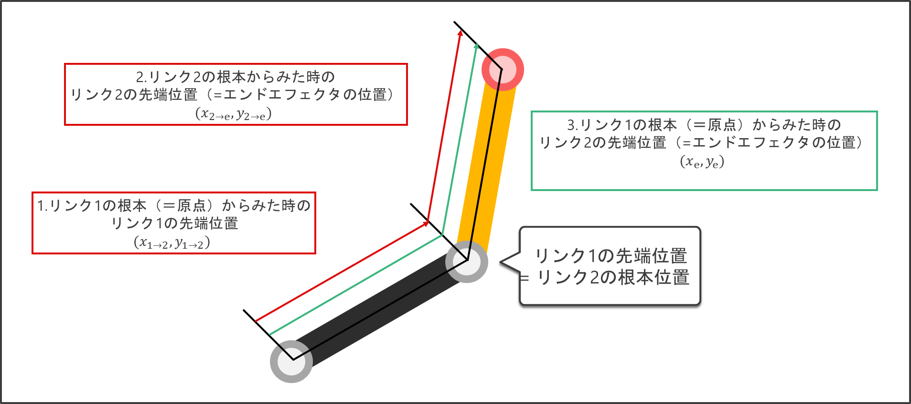
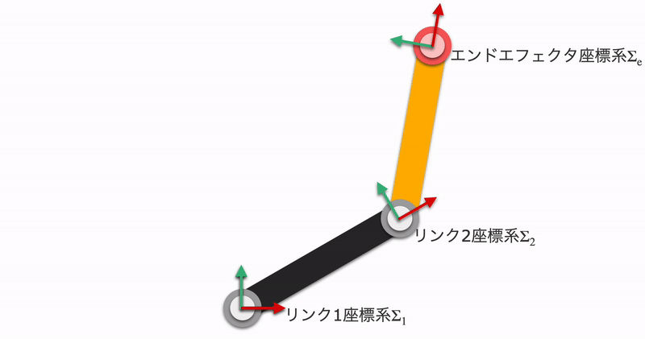

# PybulletRobotics

[Click here for English README](https://github.com/akinami3/PybulletRobotics/blob/main/README.md)

本リポジトリでは、ロボティクスにおけるpybulletの基本的な使用方法や、ロボティクスに関連する様々なアルゴリズムをpybulletを用いて実装する方法を紹介します。

# 目次
- [PybulletRobotics](#pybulletrobotics)
- [目次](#目次)
- [インストール方法](#インストール方法)
- [全般](#全般)
  - [Pybulletの基本的な使用方法](#pybulletの基本的な使用方法)
  - [ARマーカーの位置·姿勢の検出](#arマーカーの位置姿勢の検出)
- [移動ロボット](#移動ロボット)
  - [基本](#基本)
    - [移動ロボットの基本的な制御](#移動ロボットの基本的な制御)
    - [移動ロボットにおけるセンサーの利用](#移動ロボットにおけるセンサーの利用)
  - [移動ロボットによるライントレース](#移動ロボットによるライントレース)
  - [wheel odometryによる位置推定](#wheel-odometryによる位置推定)
  - [particle filterによる位置推定](#particle-filterによる位置推定)
  - [拡張カルマンフィルタによる位置推定](#拡張カルマンフィルタによる位置推定)
  - [そのた追加予定のコンテンツ](#そのた追加予定のコンテンツ)
- [ロボットアーム](#ロボットアーム)
  - [基本](#基本-1)
    - [ロボットアームの基本的な制御](#ロボットアームの基本的な制御)
    - [ロボットアームにおけるセンサーの利用](#ロボットアームにおけるセンサーの利用)
    - [衝突判定](#衝突判定)
  - [運動学](#運動学)
    - [三角関数による順運動学](#三角関数による順運動学)
    - [同次変換行列を用いた順運動学](#同次変換行列を用いた順運動学)
    - [解析的解法による逆運動学](#解析的解法による逆運動学)
    - [数値的解法によるヤコビ行列を用いた逆運動学](#数値的解法によるヤコビ行列を用いた逆運動学)
  - [eye to hand による物体位置の推定](#eye-to-hand-による物体位置の推定)
  - [eye in hand による物体位置の推定](#eye-in-hand-による物体位置の推定)
  - [image based visual servo](#image-based-visual-servo)
  - [その他、追加予定のコンテンツ](#その他追加予定のコンテンツ)
- [参考サイトなど](#参考サイトなど)
  - [筆者作成](#筆者作成)


<!-- 本リポジトリで（現時点では）扱っていない主要そうなロボット
- ドローン
- ヒューマノイドロボット
- ソフトロボティクス
- ロボットハンド
- 四足歩行ロボット
- 蜘蛛型ロボット
- 蛇型ロボット -->

# インストール方法
pybulletでロボティクスのシミュレーションを実施する際に必要なライブラリをインストールする手順は以下になります。

なお、動作確認した際の各ライブラリのバージョンは、各コマンドの隣にコメントとして記載しています。

動作確認環境：Ubuntu (WSLでも可)

```bash
sudo apt update
```

```bash
sudo apt install python3-pip
```

```bash
pip3 install pybullet # version 3.2.6
```

```bash
pip3 install numpy # version 1.24.3
```

```bash
pip3 install matplotlib # version 3.5.1
```

```bash
pip3 install opencv-contrib-python # version 4.5.4
```

```bash
pip install scipy # version 1.11.3
```


# 全般
## Pybulletの基本的な使用方法
以下に示すpybulletを用いたロボティクスの基本的な使用方法を紹介します。
- 環境の作成
- urdfファイルからのロボットの読み込み
- シミュレーションの実行

詳細は「[pybullet_basic.ipynb](https://github.com/akinami3/PybulletRobotics/blob/main/PybulletBasic/pybullet_basic_jp.ipynb)」を参照。

## ARマーカーの位置·姿勢の検出
カメラから取得した画像から、ARマーカーの位置と姿勢を検出する方法を紹介します。


<br>

また、ARマーカを貼り付けたボックスを作成する方法も紹介します（blenderを使用）。




詳細は「[ar_marker_detect.ipynb](https://github.com/akinami3/PybulletRobotics/blob/main/PybulletBasic/ar_marker_detect_jp.ipynb)」を参照。

# 移動ロボット

## 基本


### 移動ロボットの基本的な制御
2輪移動ロボットを移動させるシンプルなコードを紹介します。


詳細は「[mobile_robot_basic.ipynb](https://github.com/akinami3/PybulletRobotics/blob/main/MobileRobot/mobile_robot_basic_jp.ipynb)」を参照。

### 移動ロボットにおけるセンサーの利用
2輪移動ロボットにおける以下のセンサーの利用方法を紹介します。
- 超音波センサー
- カメラ
- LiDAR
- 落下防止センサー
- バンパー

  

<br>

**超音波センサ**  
  

<br>

**カメラ**  
  

<br>

**Lidar**  
  

<br>

**落下防止センサー**  
  

<br>

**バンパー**   
 

詳細は「[mobile_robot_sensor.ipynb](https://github.com/akinami3/PybulletRobotics/blob/main/MobileRobot/mobile_robot_sensor_jp.ipynb)」を参照。

## 移動ロボットによるライントレース
2輪の輪動ロボットのボトムカメラを使用してライントレースを行う方法を紹介します。


詳細は「[mobile_robot_line_trace.ipynb](https://github.com/akinami3/PybulletRobotics/blob/main/MobileRobot/mobile_robot_line_trace_jp.ipynb)」を参照。

## wheel odometryによる位置推定

2輪移動ロボットにおけるwheel odometryによる位置推定を行う方法を紹介します。


詳細は「[mobile_robot_wheel_odometry.ipynb](https://github.com/akinami3/PybulletRobotics/blob/main/MobileRobot/mobile_robot_wheel_odometry_jp.ipynb)」を参照。

## particle filterによる位置推定

2輪移動ロボットにおけるparticle filterによる位置推定を行う方法を紹介します。


詳細は、「[mobile_robot_particle_filter.ipynb](https://github.com/akinami3/PybulletRobotics/blob/main/MobileRobot/mobile_robot_particle_filter_jp.ipynb)」を参照。

## 拡張カルマンフィルタによる位置推定

2輪移動ロボットにおける拡張カルマンフィルタによる位置推定を行う方法を紹介します。



詳細は「[mobile_robot_extended_kalman_filter.ipynb](https://github.com/akinami3/PybulletRobotics/blob/main/MobileRobot/mobile_robot_extended_kalman_filter_jp.ipynb)」を参照。

## そのた追加予定のコンテンツ
- 経路計画
- カルマンフィルタ
- SLAM
- 教師あり学習でライントレース
- 強化学習（Q学習）

# ロボットアーム

## 基本

### ロボットアームの基本的な制御
2軸ロボットアームを制御（位置制御、速度制御、トルク制御）するシンプルなコードを紹介します。

**位置制御**


<br>

**速度制御**


<br>

**トルク制御**


詳細は「[robot_arm_basic.ipynb](https://github.com/akinami3/PybulletRobotics/blob/main/RobotArm/robot_arm_basic_jp.ipynb)」を参照。


### ロボットアームにおけるセンサーの利用
2軸ロボットアームにおける以下のセンサーの利用方法を紹介します。
- 手先のカメラ
- 手先の力センサー


<br>

**手先のカメラ**


<br>

**手先の力センサー**


詳細は「[robot_arm_sensor.ipynb](https://github.com/akinami3/PybulletRobotics/blob/main/RobotArm/robot_arm_sensor_jp.ipynb)」を参照。

### 衝突判定
ロボットアームと物体の衝突判定を行う方法を紹介します。


詳細は「[robot_arm_collision_check.ipynb](https://github.com/akinami3/PybulletRobotics/blob/main/RobotArm/robot_arm_collision_check_jp.ipynb)」を参照。

## 運動学

### 三角関数による順運動学
三角関数を用いたロボットアームの順運動学を紹介します。



詳細は「[robot_arm_trigonometric_forward_kinematics.ipynb](https://github.com/akinami3/PybulletRobotics/blob/main/RobotArm/robot_arm_trigonometric_forward_kinematics_jp.ipynb)」を参照。

### 同次変換行列を用いた順運動学
同次変換行列を用いたロボットアームの順運動学を紹介します。



詳細は「[robot_arm_homogeneous_matrix_forward_kinematics.ipynb](https://github.com/akinami3/PybulletRobotics/blob/main/RobotArm/robot_arm_homogeneous_matrix_forward_kinematics_jp.ipynb)」を参照。

### 解析的解法による逆運動学
解析的解法を用いたロボットアームの逆運動学を紹介します。


詳細は「[robot_arm_analytical_inverse_kinematics.ipynb](https://github.com/akinami3/PybulletRobotics/blob/main/RobotArm/robot_arm_analytical_inverse_kinematics_jp.ipynb)」を参照。

### 数値的解法によるヤコビ行列を用いた逆運動学
数値的解法を用いたロボットアームの逆運動学を紹介します。


詳細は「[robot_arm_jacobian_inverse_kinematics.ipynb](https://github.com/akinami3/PybulletRobotics/blob/main/RobotArm/_robot_arm_jacobian_inverse_kinematics_jp.ipynb)」を参照。

## eye to hand による物体位置の推定
eye to hand による物体位置の推定を行う方法を紹介します。


詳細は「[robot_arm_eye_to_hand.ipynb](https://github.com/akinami3/PybulletRobotics/blob/main/RobotArm/robot_arm_eye_to_hand_estimate_obj_pose_jp.ipynb)」を参照。

## eye in hand による物体位置の推定
eye in hand による物体位置の推定を行う方法を紹介します。


詳細は「[robot_arm_eye_in_hand.ipynb](https://github.com/akinami3/PybulletRobotics/blob/main/RobotArm/robot_arm_eye_in_hand_estimate_obj_pose_jp.ipynb)」を参照。

## image based visual servo
画像ベースのビジュアルサーボを行う方法を紹介します。


詳細は「[robot_arm_image_based_visual_servo.ipynb](https://github.com/akinami3/PybulletRobotics/blob/main/RobotArm/robot_arm_image_based_visual_servo_jp.ipynb)」を参照。

## その他、追加予定のコンテンツ
- PID制御
- コンフィギュレーション空間を用いた動作計画
- 力制御
- 位置と力のハイブリッド制御
- コンプライアンス制御

# 参考サイトなど

- [pybullet_quickstart_guide](https://github.com/bulletphysics/bullet3/blob/master/docs/pybullet_quickstartguide.pdf)：Pybulletで使用可能な関数がまとめられたスタートガイドです（公式）
- [PythonRobotics](https://github.com/AtsushiSakai/PythonRobotics)：Pythonで実装されたロボティクスのアルゴリズムがまとめられたリポジトリです。様々なアルゴリズムが掲載されており、ロボティクスの勉強に最適な神リポジトリです。


## 筆者作成
- [pybulletの公式サンプル129個を全部解説する - Qiita](https://qiita.com/akinami/items/7b433b60aeb5115ba4d7)：pybulletの公式サンプル129個を解説（する予定の）記事です
- [【図解】ロボティクスの辞書【python】](https://qiita.com/akinami/items/eb0741b0d9c322e5d5ec)：ロボティクスに関する技術を解説した記事の、まとめ記事です
